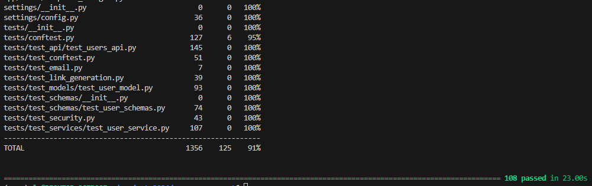
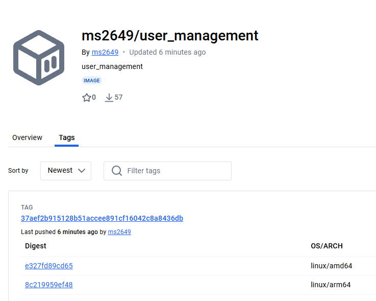

# The User Management System Final Project: Your Epic Coding Adventure Awaits! 🎉✨🔥

## Paper
Submit a 1-2 page Word document reflecting on your learnings throughout the course and your experience working on this epic project.

## Tests
[User Schemas](https://github.com/Mike-Sudol/user_management/commit/6b071d05910d7e39f2fd78c567ed74854c28e202#diff-1d7b620623536f4fb4d120c0d59e8a3ad15f248d9f7af6aa9aa8965cfe923ef9R122)

-test_user_base_empty_optional_fields

--Tests whether optional fields can be null

-test_user_base_invalid_role

--Tests trying add user with non-existent role

-test_additional_url_formats

--Tests more url formats

[User Service](https://github.com/Mike-Sudol/user_management/commit/df11fa70c78a81737f8210d0f60d85b4abc5093b#diff-e3f3da0661632e0add5f28cb40266e4bfbd6e0c1a23cdb5f5e8813af69cf1d5cR178)

-test_unauthorized_role_changes

--Tests if certain roles can change in the application

-test_operations_on_deleted_user

--Tests if you can perform operations on a deleted user

[User API](https://github.com/Mike-Sudol/user_management/commit/f4aad5bbca0c7ed0b1ed7ecb054aa981a5b68ff1)

-test_password_reset_invalid_email

--Tests if you can reset an invalid password

-test_change_password_unauthorized

--Tests if you can change a password unauthorized

-test_create_user_weak_password

--Tests creating a weak password when make a password

-test_create_user_missing_required_fields

--Tests registering without having required fields

[User Model](https://github.com/Mike-Sudol/user_management/commit/4566011606a5e0a4b98322e8f1085eece32f6f4e#diff-3a1795b15a01c16c53f898ae3833b49c22b768d8c4fad5e2f1bc9f99be7f913dR145)

-test_user_soft_delete

--Tests deleting user from the model

-test_user_metadata_updates

--Tests updating user's metadata

## Issues

1. **User Deletion Validation**: [Link](https://github.com/Mike-Sudol/user_management/issues/2)
   
Currently we are not checking if the user is an admin before they delete a user, lets fix this this by checking in the function first.

2. **Database Issues**: [Link](https://github.com/Mike-Sudol/user_management/issues/8)
   
The way we are allocating database instances to our services is heavily suboptimal

3. **Race Condition**[Link](https://github.com/Mike-Sudol/user_management/issues/6):
   
We have a potential infinite loop in an await that really slows down our execution or can stop the program all together, lets add a limit to how many times we check in the while before exiting.
   

4. **Email validation**: [Link](https://github.com/Mike-Sudol/user_management/issues/4)
   
When we verify emails, we aren't checking if they exist before we pass them on, lets fix this by checking first.

5. **CVEs and Conflicting Dependencies**: [Link](https://github.com/Mike-Sudol/user_management/issues/1)
    
Currently we have CVEs in our software as well as dependencies that are conflicting with each other, we need to change our requirements.txt to fix this

## Features
Enhanced the user profile management functionality to allow users to update their profile fields and enable managers and admins to upgrade users to professional status.

Implemented API endpoints for users to update their profile fields, such as name, bio, location, etc.
Created a separate API endpoint for managers and admins to upgrade a user to professional status.
Updated the user profile page to display the professional status and allow users to edit their profile fields.
Sends notifications to users when their professional status is upgraded.

## Dockerhub

[Link to project image deployed to Dockerhub](https://hub.docker.com/r/ms2649/user_management/tags)
